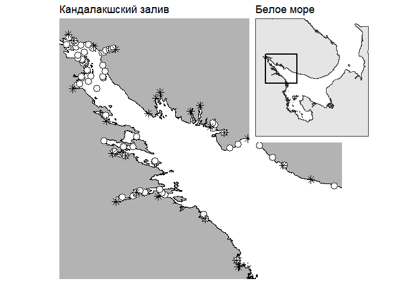

```{r setup, include=FALSE}
library(knitr)
opts_chunk$set(echo = FALSE, warning = FALSE, message = FALSE, cache = TRUE)
```


*Санкт-Петербургский государственный Университет, Биологический факультет, Кафедра зоологии беспозвоночных, Университетская набережная д. 7.*
*Кандалакшский государственный заповедник, Кандалакша, ул. Линейная д.35.*
*Лаборатория экологии морского бентоса (гидробиологии), ЭБЦ «Крестовский остров», Санкт-Петербург, Крестовский пр. д.19.*


# Введение

С тех пор, как в Белом и Баренцевом морях было идентифицировано два близких вида мидий (Katolikova et al., 2016; Väinölä and Strelkov, 2011; Буфалова et al., 2005; Католикова et al., 2010; Стрелков et al., 2008), одной из наиболее интригующих проблем стало решение вопроса о том, какие факторы определяют соотношение численностей этих видов в разных местообитаниях. В настоящее время более или менее понятно, что полной пространственной сегрегации атлантической (*Mytilus edulis*) и тихоокеанской мидии (*M.trossulus*) не наблюдается: моллюски двух видов формируют смешанные поселения, вступая при этом в ограниченную гибридизацию (Katolikova et al., 2016). Последнее определяет то, что в смешанных поселениях присутствуют не только «родительские» виды, но еще и гибриды, частота которых, впрочем, невелика (Katolikova et al., 2016). Вместе с тем, очевидно и то, что соотношение численностей двух видов в локальных поселениях варьирует в очень широких пределах от почти чистых поселений одного из видов до паритетной смеси (Katolikova et al., 2016).

Некоторые факторы, регулирующие соотношение численностей видов в локальных поселениях, все же понятны. Так, было показано, что заметную роль играет тип субстрата, к которому крепятся мидии: относительное обилие *M.trossulus* на талломах фукоидов обычно выше, чем на поверхности грунта (Katolikova et al., 2016). Предполагается, что водоросли, работающие наподобие амортизатора, гасят влияние прибоя (Katolikova et al., 2016), который должен негативно сказываться на тихоокеанских мидиях, которые, по сравнению с атлантическими мидиями, обладают более тонкими и более хрупкими раковинами (Beaumont et al., 2008). Таким образом, первым претендентом на роль ведущего фактора в формировании соотношения видов в смешанных поселениях может являться интенсивность прибоя в данном местообитании.

Вероятно, определенную роль в регуляции соотношений обилий видов играют и хищники. Так, было показано, что морские звезды *Asterias rubens* в смешанных поселениях двух видов более охотно поедают *M.trossulus* (Khaitov et al., 2018). Этому способствует, что последние обладают более тонкой раковиной (Beaumont et al., 2008) и не демонстрируют активной защиты против звезд, свойственной *M.edulis* (Lowen et al., 2013). Это делает тихоокеанскую мидию более доступной жертвой. Косвенно гипотезу о роли звезд в регуляции соотношения численностей видов подтверждает то, что в Белом море и в других морях *M.trossulus*, как правило, более многочисленны в местообитаниях, где мало звезд (Khaitov et al., 2018). Известно, что одним из самых значимых факторов, ограничивающих распределение этих хищников, является соленость (Casties et al., 2015). И, действительно, приуроченность *M.trossulus* к участкам с пониженной соленостью выражается уже в том, что сильно распресненные районы Балтийского моря, в которых морских звезд почти нет (Reimer and Tedengren, 1997), заселены исключительно тихоокеанскими мидиями (Riginos and Cunningham, 2005). Подобный паттерн наблюдается и в Кандалакшском заливе Белого моря, где тихоокеанские мидии более обильны в опресненном куту залива (Katolikova et al., 2016). Эти наблюдения заставляют считать, что вторым кандидатом на роль ведущего фактора может являться соленость или какие-то иные факторы, коррелирующие с ней.

Судя по имеющимся историческим сборам раковин из разных участков Кандалакшского залива Белого моря (Хайтов и др., 2017), в XX веке тихоокеанские мидии были крайне малочисленны в этой акватории. По нашим оценкам (Хайтов др., 2017) обильными эти моллюски стали лишь относительно недавно, после 2001 года. Это наблюдение хорошо согласуется с гипотезой о недавнем заносе M.trossulus в акваторию Белого моря с каботажными судами, курсировавшими между портами Белого и Баренцева морей (Väinölä and Strelkov, 2011; Стрелков et al., 2012). Согласно этой гипотезе, изначально M.trossulus были занесены в порты Баренцева моря с побережья Северной Америки во время Великой Отечественной Войны, судами, курсировавшими в Северной Атлантике по программе «Лэндлиз». Это дает основание предположить, что исторический фактор тоже должен играть роль в формировании паттерна распределения видов. Можно ожидать, что вид-интродуцент, *M.trossulus*, будет более обильным в местообитаниях, связанных с ныне действующими или ранее действовавшими портовыми системами, представленными в Кандалакшском заливе Белого моря. Близость к портам, как центрам, в которых изначально возникли поселения интродуцента, — это третий кандидат на роль ведущего фактора.

Описанные выше три кандидата на роль ведущего фактора (прибойность, соленость и близость к портам), на самом деле, не могут рассматриваться в отрыве друг от друга. Так, портовые сооружения в Белом море, как правило, расположены в затишных участках. Опресненные местообитания, обычно, приурочены к устьям рек, которые, в свою очередь, нередко впадают в кутовые части губ, то есть местообитания закрытые от сильного прибоя. Да и наиболее крупные порты в Кандалакшском заливе Белого моря (например, Кандалакшский морской торговый порт) расположены в населенных пунктах, расположенных на берегах полноводных рек. Все это ставит нас перед необходимостью учесть влияние всех указанных факторов одновременно, в одном анализе. Построение множественной регрессионной модели, описывающей связь соотношения обилий *M.edulis* и *M.trossulus* со всеми указанными факторами и стало задачей данной работы.


# Материал и методика

## Сбор материала

Материал был собран на литорали островов и материка Кандалакшского залива Белого моря. Всего было обследовано 93 точки (рис. 1), расположенных между г. Кандалакша и населенными пунктами Гридино (по Карельскому берегу Белого моря) и Кашкаранцы (по Кандалакшскому берегу). Часть точек (острова Северного и Лувеньгского архипелагов и мыс Турий) располагалась на территории Кандалакшского государственного заповедника. Сбор данных проводился в летние сезоны 2013-2018 гг.





В каждой точке сбор материала производился по стандартной методике, кратко сводящейся к следующему. Пробы брались во время отлива на нижней части средней литорали в поясе фукоидов. В выбранном месте производилась засечка географических координат с помощью GPS-навигатора и бралась проба воды для определения солености. В точках, расположенных в поясе фукоидов, бралось по три - пять проб. В качестве пробы мы рассматривали пучки фукоидов, выбранные случайным образом. Собранные пучки водорослей помещали в пластиковый пакет и транспортировали в лабораторию. Расстояние между отдельными пробами в пределах одной точки не превышало 10 метров. С водорослей были сняты мидии, из которых в дальнейший анализ были вовлечены только особи с длиной раковины не менее 10 мм. Все мидии из каждой пробы были сварены, раковины очищены от мягких тканей и высушены.

На сухих створках производилась оценка выраженности конхиологического признака, ранее предложенного В. Н. Золотаревым и Н. М. Шуровой (Золотарев, Шурова, 1997), как диагностического для разделения *M. trossulus* и *M. galloprovincialis* из Японского моря. Данный признак основан на степени развития перламутрового слоя в районе лигамента: у тихоокеанской мидии в этой зоне перламутр не откладывается, вследствие чего здесь просматривается полоска призматического слоя (у средиземноморской мидии призматический слой в этой зоне закрыт перламутровым). В более поздних работах (Katolikova et al., 2016; Khaitov et al., 2018) было показано, что этот признак позволяет с высокой вероятностью дискриминировать *M.trossulus* и *M.edulis*, обитающих в Белом море. Однако, поскольку диагностика, основанная на этом признаке, имеет вероятностный характер, то в данной работе мы будем оперировать не понятием «вид», а понятием «морфотип». Мидий с недоразвитым перламутром мы будем обозначать, как T-морфотип (эти моллюски с высокой вероятностью относятся к виду *M.trossulus*). Особей с развитым перламутром, закрывающим частично или полностью призматический слой в районе лигамента, мы будем относить к E-морфотипу (такие моллюски с высокой вероятностью относятся к *M.edulis*). В каждой пробе было подсчитана численность особей каждого из морфотипов.

## Зависимая переменная

В качестве зависимой переменной для дальнейшего анализа мы использовали долю особей T-морфотипа в общей численности всех особей, собранных в данной точке (для вычисления этого показателя материал всех проб из данной точки был объединен). Предложенная величина высоко коррелирует с долей *М.trossulus* (рис. 2), что позволяет рассматривать долю T-морфотипа, как хорошую оценку соотношения обилий видов, формирующих смешанные поселения. Для стабилизации дисперсии в регрессионном анализе мы проводили арксинус преобразование доли T-морфотипа .

```{r graph1, fig.align='center', fig.height=3, fig.keep='all'}
myt <- read.table(file = "data/myt_all.csv", sep = ";", header = TRUE)
myt$Morph <- ifelse(myt$Z == 0, "T_m", "E_m") 
library(dplyr)

myt_prop <- myt %>% group_by(population) %>% summarise(Prop_Tm = mean(Morph == "T_m", na.rm = TRUE), Prop_MT = mean(species == "trossulus", na.rm = TRUE)  )

library(ggplot2)

ggplot(data = myt_prop, aes(x = Prop_MT, y = Prop_Tm)) + geom_abline(slope = 1, intercept = 0, color = "gray", size = 2) + geom_point(size = 4, color = "red") + theme_bw() + labs(x = "Доля M.trossulus в точке сбора", y = "Доля T-морфотипа в точке сбора")

```

*Рисунок 2.* Соотношение доли M.trossulus (выявленных по результатам генетических исследований) и доли T-морфотипа (по данным из Katolilkova et al., 2016). Точки ложатся вдоль линии Y = X. 


## Пердикторы
Степень прибойности. Для оценки степени прибойности каждой из точек мы провели оценку пространства потенциально открытого для ветра, нагоняющего волну с каждой из четырех сторон света. Данная оценка основана на расстоянии, которое может пройти поток воздуха, не встретив преград в виде побережий островов или материка.

В качестве оценки этого параметра мы рассматривали величину «wind fetch» (далее $WF$), которую рассчитывает функция fetch(), реализованная в пакете fetchR (Seers, 2018). Чем более открыта для прибоя акватория, тем больше величина $WF$ (рис. 3). Самые открытые участки были расположены на прибойных мористых островах Кандалакшского залива и на побережье от мыса Турий до поселка Кашкаранцы.


*Соленость.* Для оценки роли солености мы воспользовались двумя показателями. Во-первых, соленость воды, измеренная в данной точке во время взятия проб (измерения с точностью до 1 промилле c помощью портативного рефрактометра). Во-вторых, используя данные сайта https://ru.wikipedia.org/wiki/ (раздел Реки_Мурманской_области#Бассейн_Белого_моря) мы выделили 25 крупных рек (табл. 1), впадающих в Кандалакшский залив Белого моря. Для каждой из рек мы определили координаторы устья (определение координат производилось с помощью сервиса Google Maps). Это позволило для каждой точки сбора материала определить кратчайшее расстояние до устья ближайшей реки. Эту величину мы также рассматривали как оценку потенциального опреснения в точке сбора материала.

*Близость к портам.* Для оценки роли портовых структур в формировании соотношения численностей видов в смешанных поселениях мы рассмотрели 5 важнейших, в ретроспективе, портовых пунктов (табл. 2). Часть их этих пунктов активно действует до сих пор, а часть была активна в прошлом (табл. 2). Для каждой точки сбора материала было вычислено кратчайшее расстояние до ближайшего портового пункта.


```{r table1}
river <- read.table("data/river.csv", header = TRUE, sep = ",")
kable(river, align = "lccr", col.names = c("Название реки", "Широта", "Долгота", "Площадь водосбора, кв. км"), caption = "Таблица 1. Крупные реки, впадающие акваторию Кандалакшского залива Белого моря. Приведены координаты устья.", )
```


```{r table2}
port <- read.table("data/port.csv", header = TRUE, sep = ",")
kable(port, align = "lccr", col.names = c("Портовой пункт", "Широта", "Долгота", "Состояние на момент сбора материала"), caption = "Таблица 2. Характеристики портовых пунктов, расположенных в Кандалакшском заливе Белого моря.", )
```


