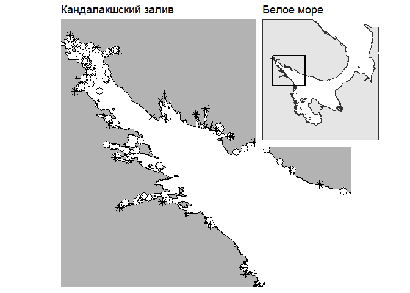

<style type="text/css">

body{ /* Normal  */
      font-size: 20px;
  }
td {  /* Table  */
  font-size: 18px;
  color: Red;
}
h1.title {
  font-size: 38px;
  color: Blue;
}
h1 { /* Header 1 */
  font-size: 35px;
  color: DarkBlue;
}
h2 { /* Header 2 */
    font-size: 25px;
  color: DarkBlue;
}
h3 { /* Header 3 */
  font-size: 20px;
  font-family: "Times New Roman", Times, serif;
  color: DarkBlue;
}
code.r{ /* Code block */
    font-size: 12px;
}
pre { /* Code block - determines code spacing between lines */
    font-size: 14px;
    
}
</style>

```{r setup, include=FALSE}
library(knitr)
opts_chunk$set(echo = FALSE, warning = FALSE, message = FALSE, cache = TRUE)


```

*Санкт-Петербургский государственный Университет, Биологический факультет, Кафедра зоологии беспозвоночных, Университетская набережная д. 7.<br>Кандалакшский государственный заповедник, Кандалакша, ул. Линейная д.35.<br>Лаборатория экологии морского бентоса (гидробиологии), ЭБЦ «Крестовский остров», Санкт-Петербург, Крестовский пр. д.19.*

# Введение

<br>

С тех пор, как в Белом и Баренцевом морях было идентифицировано два близких вида мидий [@katolikova2016genetic; @vainola2011mytilus; @bufalova2005midii; @katolicova2010tichooceanskay; @strelkov2008discriminaciay], одной из наиболее интригующих проблем стало решение вопроса о том, какие факторы определяют соотношение численностей этих видов в разных местообитаниях. В настоящее время более или менее понятно, что полной пространственной сегрегации атлантической (*Mytilus edulis*) и тихоокеанской мидии (*M.trossulus*) не наблюдается: моллюски двух видов формируют смешанные поселения, вступая при этом в ограниченную гибридизацию [@katolikova2016genetic]. Последнее определяет то, что в смешанных поселениях присутствуют не только «родительские» виды, но еще и гибриды, частота которых, впрочем, невелика [@katolikova2016genetic]. Вместе с тем, очевидно и то, что соотношение численностей двух видов в локальных поселениях варьирует в очень широких пределах от почти чистых поселений одного из видов до паритетной смеси [@katolikova2016genetic].

Некоторые факторы, регулирующие соотношение численностей видов в локальных поселениях, все же понятны. Так, было показано, что заметную роль играет тип субстрата, к которому крепятся мидии: относительное обилие M.trossulus на талломах фукоидов обычно выше, чем на поверхности грунта [@katolikova2016genetic]. Предполагается, что водоросли, работающие наподобие амортизатора, гасят влияние прибоя [@katolikova2016genetic], который должен негативно сказываться на тихоокеанских мидиях, которые, по сравнению с атлантическими мидиями, обладают более тонкими и более хрупкими раковинами [@beaumont2008three]. Таким образом, первым претендентом на роль ведущего фактора в формировании соотношения видов в смешанных поселениях может являться интенсивность прибоя в данном местообитании.

Вероятно, определенную роль в регуляции соотношений обилий видов играют и хищники. Так, было показано, что морские звезды Asterias rubens в смешанных поселениях двух видов более охотно поедают M.trossulus [@khaitov2018discriminating]. Этому способствует, что последние обладают более тонкой раковиной [@beaumont2008three] и не демонстрируют активной защиты против звезд, свойственной *M.edulis* [@lowen2013predator]. Это делает тихоокеанскую мидию более доступной жертвой. Косвенно гипотезу о роли звезд в регуляции соотношения численностей видов подтверждает то, что в Белом море и в других морях M.trossulus, как правило, более многочисленны в местообитаниях, где мало звезд [@khaitov2018discriminating]. Известно, что одним из самых значимых факторов, ограничивающих распределение этих хищников, является соленость [@casties2015salinity]. И, действительно, приуроченность *M.trossulus* к участкам с пониженной соленостью выражается уже в том, что сильно распресненные районы Балтийского моря, в которых морских звезд почти нет [@reimer1997predator], заселены исключительно тихоокеанскими мидиями [@riginos2005invited]. Подобный паттерн наблюдается и в Кандалакшском заливе Белого моря, где тихоокеанские мидии более обильны в опресненном куту залива [@katolikova2016genetic]. Эти наблюдения заставляют считать, что вторым кандидатом на роль ведущего фактора может являться соленость или какие-то иные факторы, коррелирующие с ней.

Судя по имеющимся историческим сборам раковин из разных участков Кандалакшского залива Белого моря [@chaitov2017istoria], в XX веке тихоокеанские мидии были крайне малочисленны в этой акватории. По нашим оценкам [@chaitov2017istoria] обильными эти моллюски стали лишь относительно недавно, после 2001 года. Это наблюдение хорошо согласуется с гипотезой о недавнем заносе *M.trossulus* в акваторию Белого моря с каботажными судами, курсировавшими между портами Белого и Баренцева морей [@vainola2011mytilus; @strelcov2012golubue]. Согласно этой гипотезе, изначально M.trossulus были занесены в порты Баренцева моря с побережья Северной Америки во время Великой Отечественной Войны, судами, курсировавшими в Северной Атлантике по программе «Лэндлиз». Это дает основание предположить, что исторический фактор тоже должен играть роль в формировании паттерна распределения видов. Можно ожидать, что вид-интродуцент, *M.trossulus*, будет более обильным в местообитаниях, связанных с ныне действующими или ранее действовавшими портовыми системами, представленными в Кандалакшском заливе Белого моря. Близость к портам, как центрам, в которых изначально возникли поселения интродуцента, — это третий кандидат на роль ведущего фактора. 

Описанные выше три кандидата на роль ведущего фактора (прибойность, соленость и близость к портам), на самом деле, не могут рассматриваться в отрыве друг от друга. Так, портовые сооружения в Белом море, как правило, расположены в затишных участках. Опресненные местообитания, обычно, приурочены к устьям рек, которые, в свою очередь, нередко впадают в кутовые части губ, то есть местообитания закрытые от сильного прибоя. Да и наиболее крупные порты в Кандалакшском заливе Белого моря (например, Кандалакшский морской торговый порт) расположены в населенных пунктах, расположенных на берегах полноводных рек. Все это ставит нас перед необходимостью учесть влияние всех указанных факторов одновременно, в одном анализе. Построение множественной регрессионной модели, описывающей связь соотношения обилий *M.edulis* и *M.trossulus* со всеми указанными факторами и стало задачей данной работы.


# Материал и методика

## Сбор материала

Материал был собран на литорали островов и материка Кандалакшского залива Белого моря. Всего было обследовано 93 точки (рис. 1), расположенных между г. Кандалакша и населенными пунктами Гридино (по Карельскому берегу Белого моря) и Кашкаранцы (по Кандалакшскому берегу). Часть точек (острова Северного и Лувеньгского архипелагов и мыс Турий) располагалась на территории Кандалакшского государственного заповедника. Сбор данных проводился в летние сезоны 2013-2018 гг.




В каждой точке сбор материала производился по стандартной методике, кратко сводящейся к следующему. Пробы брались во время отлива на нижней части средней литорали в поясе фукоидов. В выбранном месте производилась засечка географических координат с помощью GPS-навигатора и бралась проба воды для определения солености. В точках, расположенных в поясе фукоидов, бралось по три - пять проб. В качестве пробы мы рассматривали пучки фукоидов, выбранные случайным образом. Собранные пучки водорослей помещали в пластиковый пакет и транспортировали в лабораторию. Расстояние между отдельными пробами в пределах одной точки не превышало 10 метров. С водорослей были сняты мидии, из которых в дальнейший анализ были вовлечены только особи с длиной раковины не менее 10 мм. Все мидии из каждой пробы были сварены, раковины очищены от мягких тканей и высушены.

На сухих створках производилась оценка выраженности конхиологического признака, ранее предложенного В. Н. Золотаревым и Н. М. Шуровой [@zolotarev1997sootnoshenie], как диагностического для разделения *M. trossulus* и *M. galloprovincialis* из Японского моря. Данный признак основан на степени развития перламутрового слоя в районе лигамента: у тихоокеанской мидии в этой зоне перламутр не откладывается, вследствие чего здесь просматривается полоска призматического слоя (у средиземноморской мидии призматический слой в этой зоне закрыт перламутровым). В более поздних работах [@katolikova2016genetic; @khaitov2018discriminating] было показано, что этот признак позволяет с высокой вероятностью дискриминировать *M.trossulus* и *M.edulis*, обитающих в Белом море. Однако, поскольку диагностика, основанная на этом признаке, имеет вероятностный характер, то в данной работе мы будем оперировать не понятием «вид», а понятием «морфотип». Мидий с недоразвитым перламутром мы будем обозначать, как T-морфотип (эти моллюски с высокой вероятностью относятся к виду *M.trossulus*). Особей с развитым перламутром, закрывающим частично или полностью призматический слой в районе лигамента, мы будем относить к E-морфотипу (такие моллюски с высокой вероятностью относятся к *M.edulis*). В каждой пробе было подсчитана численность особей каждого из морфотипов.

## Зависимая переменная

В качестве зависимой переменной для дальнейшего анализа мы использовали долю особей T-морфотипа в общей численности всех особей, собранных в данной точке (для вычисления этого показателя материал всех проб из данной точки был объединен). Предложенная величина высоко коррелирует с долей М.trossulus (рис. 2), что позволяет рассматривать долю T-морфотипа, как хорошую оценку соотношения обилий видов, формирующих смешанные поселения. Для стабилизации дисперсии в регрессионном анализе мы проводили арксинус преобразование доли T-морфотипа .

```{r graph1, fig.align='center', fig.height=4, fig.keep= 'all'}
myt<- read.table(file = "data/myt_all.csv", sep = ";", head = TRUE)
myt$Morph <- ifelse (test = myt$Z == 0, yes = "T_m", no = "E_m") 
library(dplyr)

myt_prob <- myt %>% group_by(population) %>% summarise(Prop_Tm = mean(Morph == "T_m", na.rm = TRUE), Prop_MT = mean(species == "trossulus", na.rm = TRUE ) )

library(ggplot2)

ggplot( data = myt_prob, aes(x = Prop_MT, y = Prop_Tm))+geom_abline(slope = 1,intercept = 0, color = "gray", size = 2) + geom_point(size = 4, color = "red")+ theme_bw()+ labs(x = "доля M.trossulus в точке сбора", y = "доля T-морфотипа в точке сбора")
```

*Рисунок 2*.Соотношение доли M.trossulus (выявленных по результатам генетических исследований) и доли T-морфотипа(по данным из [@katolikova2016genetic]). Точки ложатся вдоль линии Y = X.

## Пердикторы

Степень прибойности. Для оценки степени прибойности каждой из точек мы провели оценку пространства потенциально открытого для ветра, нагоняющего волну с каждой из четырех сторон света. Данная оценка основана на расстоянии, которое может пройти поток воздуха, не встретив преград в виде побережий островов или материка.

В качестве оценки этого параметра мы рассматривали величину «wind fetch» (далее $WF$), которую рассчитывает функция fetch(), реализованная в пакете fetchR [@seers2018]. Чем более открыта для прибоя акватория, тем больше величина $WF$ (рис. 3). Самые открытые участки были расположены на прибойных мористых островах Кандалакшского залива и на побережье от мыса Турий до поселка Кашкаранцы.


*Соленость.* Для оценки роли солености мы воспользовались двумя показателями. Во-первых, соленость воды, измеренная в данной точке во время взятия проб (измерения с точностью до 1 промилле c помощью портативного рефрактометра). Во-вторых, используя данные сайта https://ru.wikipedia.org/wiki/ (раздел Реки_Мурманской_области#Бассейн_Белого_моря) мы выделили 25 крупных рек (табл. 1), впадающих в Кандалакшский залив Белого моря. Для каждой из рек мы определили координаторы устья (определение координат производилось с помощью сервиса Google Maps). Это позволило для каждой точки сбора материала определить кратчайшее расстояние до устья ближайшей реки. Эту величину мы также рассматривали как оценку потенциального опреснения в точке сбора материала.

*Близость к портам.* Для оценки роли портовых структур в формировании соотношения численностей видов в смешанных поселениях мы рассмотрели 5 важнейших, в ретроспективе, портовых пунктов (табл. 2). Часть их этих пунктов активно действует до сих пор, а часть была активна в прошлом (табл. 2). Для каждой точки сбора материала было вычислено кратчайшее расстояние до ближайшего портового пункта.

```{r table1}

river <- read.table("data/River.csv", header = TRUE, sep = "," )
kable(river, align = "lccc", col.names = c("Название реки", "Широта", "Долгота", "Площадь водосбора, кв. км"), caption = "*Таблица 1.* Крупные реки, впадающие акваторию Кандалакшского залива Белого моря. Приведены координаты устья.")

```


```{r table2}
port <- read.table("data/Port.csv", header= TRUE, sep = ",") 
kable(port, align = "lccr", col.names= c("Портовый пункт","Широта","Долгота", "Состояние на момент сбора материала"), caption = "*Таблица 2*. Характеристики портовых пунктов, расположенных в Кандалакшском заливе Белого моря.")
```

## Регрессионная модель и особенности ее подгонки

 Важно отметить, что сбор материала проводился на точках, расположенных вдоль Кандалакшского и Карельского берегов Кандалакшского залива. То есть, по сути дела, материал собирали на двух трансектах, идущих от кута залива к его устью. Это заставляет учитывать при рассмотрении интересующих нас взаимосвязей еще и географическую составляющую. В связи с этим, была построена обобщенная аддитивная регрессионная модель (GAM), включающая, помимо предикторов, описанных выше, также две сглаживающие функции (использовались кубические сплайны), описывающие связь переменной отклика с положением на одной из трансект. Таким образом, модель имела следующий вид
 
 $$
 \varphi _{i} = b_{0} + b_{1}WF_{i} + b_{2} DP_{i}+ b_{3} Sal_{i} + b_{4} DR_{i} + s(Dist_{kand})+ s(Dist_{Karel}) + ee_{i}
 $$

### В этой модели

$\varphi_{i}$  - Доля T-морфотипа в i-той точке, после арксинус преобразования.

$WF_{i}$ - Безразмерная величина, характеризующая степень прибойности в данной точке.

$DP_{i}$ - Расстояние по прямой до ближайшего портового пункта.

$Sal_{i}$ - Соленость, измеренная в данной точке во время сбора материала.

$DR_{i}$ - Расстояние по прямой до устья ближайшей крупной реки.

$s(Dist_{kand})$ - сглаживающая функция, описывающая связь φ с расстоянием до кута Кандалакшского залива, при движении вдоль Кандалакшского берега.

$s(Dist_{Karel})$ 	- сглаживающая функция, описывающая связь φ с расстоянием до кута Кандалакшского залива, при движении вдоль Карельского берега.

$e_{i} \in N(O,\sigma^2)$ - остатки.

В качестве точки, маркирующей кут залива, рассматривалось устье реки Лупче-Савино ( `r river$N[river$River == "Лупче-Савино"]` N, `r river$E[river$River == "Лупче-Савино"]` E) 

Все предикторы, использованные для подгонки модели, были стандартизированы: из исходных величин было вычтено среднее значение данного параметра и разность поделена на среднеквадратичное отклонение.

Вся статистическая обработка проводилась с использованием функций статистического программирования R [@r]. Подбор параметров модели осуществлялся с помощью функции gam() из пакета mgcv [@Wood2003].

## Результаты

Доля мидий T-морфотипа в общей численности моллюсков колебалось в достаточно широких пределах от 0% до 93%. Частотное распределение этой величины (рис. 4) носило явно выраженный бимодальный характер. Это свидетельствует о том, что в изученной акватории присутствуют места, заселенные преимущественно мидиями E-морфотипа (левый пик в распределении) и места, заселенные преимущественно T-морфотипом (правый пик). Впрочем, следует отметить, что количество проб, приходящихся на переходную зону между двумя пиками (значения близкие к 50%), достаточно велико. Последнее говорит о том, что мощной тенденции к сегрегации моллюсков двух морфотипов не выявляется.

```{r fig.align='center'}
myt2<- read.table(file = "data/myt_Z0_all_full.csv", sep = ",", head = TRUE)
ggplot( data = myt2, aes(x = PropT*100)) +geom_histogram(binwidth = 10, fill = "Grey", color = "black" ) + theme_bw() + labs(x= "Доля мидий T-морфотопа в поселении (%)", y ="Количество проб" )


```


*Рисунок 4.* Частотное распределение значений доли моллюсков T-морфотипа в общей численности мидий, собранных в пределах одной точки (пробы).

Параметры подобранной модели приведены в табл. 3. Для оценки соответствия построенной модели условиям применимости аддитивных моделей мы провели визуальное изучение диаграмм рассеяния остатков в зависимости от предсказанных значений и от всех предикторов, включенных в модель, мы не обнаружили явных паттернов и признаков гетероскедастичности. Также мы не выявили явных паттернов при анализе связи остатков с географическими координатами. Оценка фактора раздутия дисперсии (Variance inflation factor) не выявила признаков мультиколлинеарности предикторов. Дополнительно валидность модели была проверена с помощью тестов, рассчитанных на аддитивные модели, реализованные в функции gam.check() из пакета mgcv, которые также не выявили признаков нарушения условий применимости метода. Это позволяет обсуждать значимость полученных оценок коэффициентов модели (Табл. 3).

Анализ показал, что значимо от нуля отличается только коэффициент при предикторе DP, расстояние до ближайшего порта. Этот коэффициент был ниже нуля, то есть чем дальше от портового пункта находится точка, тем меньше в ней доля T-морфотипа. Действительно, наиболее высокая концентрация мидий T-морфотипа наблюдается в вершине залива, а также в районе пос. Умба и в губе Чупа (рис. 5). В этих районах функционируют или ранее функционировали портовые системы.

Таблица 3. Параметры модели, описывающей связь доли T-морфотипа в поселении с набором предикторов. Скорректированный коэффициент детерминации для модели составляет $R^2_{adj}$= 0.64; модель описывает 69.1% суммарной девиансы.

| Параметр модели      | Оценка параметра | Ошибка      | t-критерий   | p                 |
|----------------------|------------------|-------------|--------------|-------------------|
|    Cвобобный член    |    81.514        |    2.413    |    33.785    |    <0.0001 ***    |
|    WF                |    -4.131        |    3.366    |    -1.227    |    0.2235         |
|    Sal               |    -1.814        |    2.848    |    -0.637    |    0.526          |
|    DR                |    -2.624        |    3.453    |    -0.76     |    0.4495         |
|    DP                |    -14.544       |    6.165    |    -2.359    |    0.0208 *       |

<center> Оценка значимости сглаживающих функций </center>


|    Сглаживающая функция    |    Edf      |    Ref.df    |    F         |    p              |
|----------------------------|-------------|--------------|--------------|-------------------|
| $s(Dist_{Kand})$           |    2.25     |    2.753     |    11.738    |    <0.0001 ***    |
| $s(Dist_{Karel})$          |    7.713    |    8.085     |    7.234     |    <0.0001 ***    |


Важно отметить, что по северо-восточному побережью Кандалакшского залива (от пос. Кашкаранцы до мыса Турий) мидии T-морфотипа практически не встречались. Самое же мощное скопление мидий T-морфотипа отмечается в кутовой части залива, где располагается единственный в настоящее время активно действующий Кандалакшский морской торговый порт. Здесь же находится и недавно переставший функционировать порт “Витино”. Размеры скоплений в районах заброшенных портовых пунктов Чупы и Умбы заметно ниже.

## Обсуждение

Анализ соотношения численностей мидий двух морфотипов показал, что в акватории Кандалакшского залива присутствуют три типа поселений мидий. Во-первых, это поселения, в которых большинство особей составляют особи E-морфотипа (их относительная численность составляет около 80%, рис. 4) . Во-вторых, это поселения, где 70-80% особей составляют мидии T-морфотипа. Третий тип поселений - это смешанные поселения, где мидии двух морфотипов представлены в более или мене равном количестве. Судя по высоте пиков (рис. 4) площадь, занимаемая поселениями первого типа выше, чем площадь, занимаемая поселениями второго типа. К сожалению, из-за неравномерности пространственного распределения точек сбора материала точно оценить соотношение площадей мы не можем.

Проведенный нами анализ позволил выявить связь относительного обилия мидий T-морфотипа лишь с расстоянием до ближайшего порта. Чем ближе порт тем больше доля мидий T-морфотипа в смешанном поселении. Никаких статистически значимых связей с оценками солености или с оценками прибойности нам выявить не удалось.

Поскольку морфотипы мидий отражают их видовую принадлежность (мидии T-морфотипа с высокой вероятностью являются *M.trossulus*, а мидии E-морфотипа - *М.edulis*, рис. 2), то полученные нами данные заставляют уточнить традиционные объяснения паттернов пространственного распределения двух видов. До сих пор считалось, что *M.trossulus*, будучи более толерантными к пониженной солености, заселяют более опресненные акватории, которых избегают *M.edulis* [@riginos2005invited;@stuckas2017combining]. Поскольку в Кандалакшском заливе Белого моря из-за впадения в акваторию многочисленных рек, существуют отчетливо выраженные градиенты солености, то отсутствие явной связи с этим параметром, отмеченное при анализа нашего материала, говорит, скорее, о второстепенной роли солености в регуляции распределения двух видов.

Другой кандидат на роль ведущего фактора - степень прибойности, казался значимым для Западной Атлантики, где *M.trossulus* более обильны на прибойных участках побережья, а *M.edulis* - на затишных [@innes1999morphological]. Казалось, также, что с гипотезой о роли прибоя хорошо согласуются, данные о локальной сегрегации видов, связанной с типом субстрата [@katolikova2016genetic]. Согласно этой гипотезе, более хрупкие *M.trossulus* тяготеют к амортизирующим волновое воздействие талломам фукоидов. Это предположение позволяет ожидать большего обилия мидий T-морфотипа в затишных местообтаниях. Учитывая то, что в Кандалакшском заливе градиенты прибойности выражены очень хорошо: в одном и том же районе можно найти как открытые, прибойные местообитания, так и закрытые, можно было бы ожидать, что степень прибойности будет оказывать существенное влияние на соотношение численностей мидий разных морфотипов. Тем не менее, существенной связи со степенью открытости акватории, то есть доступностью для волнового воздействия, мы не выявили. Впрочем, здесь возможно и альтернативное объяснение. Поскольку мы, для стандартизации данных, включили в анализ только сборы с фукоидов (см. «Материал и методы»), отсутствие явной связи с предиктором, характеризующим прибойность, может быть следствием того, что фукоиды, действительно, являются хорошим амортизатором, сглаживающим разрушительный эффект прибоя. Для проверки этой гипотезы нужны дополнительные исследования.

Единственным важным фактором, регулирующим соотношение двух видов мидий в масштабе изученной акватории, является близость к портам. Этот результат хорошо согласуется с гипотезой заноса *M.trossulus* в акваторию Белого моря каботажными судами [@vainola2011mytilus], в 40-50х годах прошлого века, до сих пор к ним тяготеют.

Можно предположить, что между столь близкими формами, как *M.edulis* и *M.trossulus* должна существовать достаточно сильная конкуренция. Если допустить, что коренной вид M.edulis конкурент более сильный, то его присутствие может сдерживать экспансию вида-вселенца, запирая его в неблагоприятных урбанизированных акваториях портов и прилегающих районов. Видимо, эти вселенцы, все-таки, при некоторых условиях могут выходить из рефугиумов, связанных с портами, и расселяться по окрестным местообитаниям. Так, в течение нескольких лет мы наблюдали явное увеличение доли мидий T-морфотипа на литорали острова Ряжков, удаленного от ближайшего порта на расстояние более 10 км [@chaitov2017istoria].

Возможно, экспансии вида-вселенца способствуют катастрофические распреснения [@chaitov2017istoria], или какие-нибудь другие воздействия, уничтожающие поселения коренного для Белого моря вида *M.edulis*. Весьма вероятно, именно такой процесс привел к образованию обширной зоны, заселенной *M.trossulus* в вершине Кандалакшского залива, подверженному мощным сбросам пресной воды из каскадов водохранилищ ГЭС [@chaitov2017istoria]. Однако однозначных свидетельств о том, что конкуренция с *M.edulis* может сдерживать распространение *M.trossulus*, пока не получено.

Если наши рассуждения верны, то присутствие локальных скоплений M.trossulus среди фоновых поселений *M.edulis*, которое мы наблюдаем в Кандалакшском заливе, возможно и в других акваториях, это не результат присутствия градиента какого-то экологического фактора (соленость, степень прибойности и т.п.), «разводящего» виды в пространстве. Это может быть результатом действия исторических причин: диаспора вида-вселенца присутствует именно там, куда ее занесло судами, курсирующими между данным местом и областью обитания «маточной» популяции вселенца.

## Благодарности

 Авторы искренне признательны администрации Кандалакшского заповедника за всестороннюю поддержку во время проведения полевых работ и Г.Г. Паскеровой, Е.А. Генельт-Яновскому, Ю.А. Даниловой, А.А. Виландеру и В. В. Хайтовой за помощь в сборе материала. Мы благодарим всех участников Беломорских экспедиций Лаборатории экологии морского бентоса (гидробиологии) за создание творческой атмосферы в экспедициях и помощь в решении технических и бытовых проблем.

## Литература

<!--  Буфалова Е.Н., Стрелков П.П., Католикова М.В., Сухотин А.А., Козин М.Б. 2005 Мидии рода *Mytilus* губы Тюва (Кольский залив, Баренцево море). // Вестник Санкт-Петербургского университета. Серия 3: Биология. P. 99–105 -->
<!-- Золотарев В.Н., Шурова Н.М. 1997 Соотношение призматического и перламутрового слоев в раковинах мидий Mytilus trossulus. // Биология моря. Vol.23, P. 26–30 -->

<!-- Католикова М.В., Стрелков П.П., Хайтов В.М., Ганцевич М.М., Вайнола Р. 2010 Тихоокеанская мидия *Mytilus trossulus* в Белом море: Распространение, экологические и генетические взаимоотношения с *Mytilus edulis.* // Изучение, рациональное использование и охрана природных ресурсов Белого моря. P. 71–72 -->

<!-- Стрелков П.П., Католикова М.В., Лайус Д.Л., Андреев В.М., Федюк М.Л. 2008 Дискриминация беломорских мидий *Mytilus edulis* L. И *M.Trossulus Gould.* // Вестник Санкт-Петербургского университета. Серия 3: Биология., 3rd ser. P. 77–82 -->

<!-- Стрелков П., Хайтов В., Католикова М. 2012 Голубые ракушки. // Пирода. P. 51–56 -->

<!-- Хайтов B.М., Зайчикова А., M.В. И., Католикова M., Короткова Т., Кудрявцева Е., Полоскин А., Уваров К., Стрелков П. 2017 История формирования совместных поселений *Mytilus edulis Linnaeus* и *M.trossulus Gould* в Кандалакшском заливе Белого моря, in: Изучение, рациональное использование и охрана природных ресурсов Белого моря. Зоол. ин-т РАН, Санкт-Петербург, pp. 229–232 -->

<!-- Beaumont A.R., Hawkins M.P., Doig F.L., Davies I.M., Snow M. 2008 Three species of Mytilus and their hybrids identified in a scottish loch: Natives, relicts and invaders? // Journal of Experimental Marine Biology and Ecology. Vol.367, P. 100–110 -->

<!-- Casties I., Clemmesen C., Melzner F., Thomsen J. 2015 Salinity dependence of recruitment success of the sea star Asterias rubens in the brackish western Baltic Sea. // Helgoland Marine Research. Vol.69, P. 169–175. -->

<!-- Innes D.J., Bates J.A. 1999 Morphological variation of Mytilus edulis and Mytilus trossulus in eastern Newfoundland. // Marine Biology. Vol.133, P. 691–699 -->

<!-- Katolikova M., Khaitov V., Väinölä R., Gantsevich M., Strelkov P. 2016 Genetic, ecological and morphological distinctness of the blue mussels Mytilus trossulus Gould and M. Edulis L. In the White Sea. // PLOS ONE. Vol.11, P. e0152963. doi:10.1371/journal.pone.0152963 -->

<!-- Khaitov V., Makarycheva A., Gantsevich M., Lentsman N., Skazina M., Gagarina A., Katolikova M., Strelkov P. 2018 Discriminating eaters: Sea stars asterias rubens l. Feed preferably on *mytilus trossulus* gould in mixed stocks of mytilus trossulus and mytilus edulis l. // The Biological Bulletin. Vol.234, P. 85–95 -->

<!-- Lowen J., Innes D., Thompson R. 2013 Predator-induced defenses differ between sympatric *Mytilus edulis* and *M. Trossulus.* // Marine Ecology Progress Series. Vol.475, P. 135–143 -->

<!-- R Core Team 2018 R: A language and environment for statistical computing. R Foundation for Statistical Computing, Vienna, Austria -->

<!-- Reimer O., Tedengren M. 1997 Predator-induced changes in byssal attachment, aggregation and migration in the blue mussel, Mytilus edulis. // Marine & Freshwater Behaviour & Physioloy. Vol.30, P. 251–266 -->

<!-- Riginos C., Cunningham C.W. 2005 Local adaptation and species segregation in two mussel (*Mytilus edulis* × *Mytilus trossulus*) hybrid zones: // Molecular Ecology. Vol.14, P. 381–400 -->

<!-- Seers B. 2018 FetchR: Calculate wind fetch -->

<!-- Stuckas H., Knöbel L., Schade H., Breusing C., Hinrichsen H.-H., Bartel M., Langguth K., Melzner F. 2017 Combining hydrodynamic modelling with genetics: Can passive larval drift shape the genetic structure of Baltic Mytilus populations? // Molecular Ecology. Vol.26, P. 2765–2782 -->

<!-- Väinölä R., Strelkov P. 2011 *Mytilus trossulus* in Northern Europe. // Marine Biology. Vol.158, P. 817–833 -->
<!-- Wood S. 2017 Generalized additive models: An introduction with r, 2nd ed. Chapman; Hall/CRC -->


